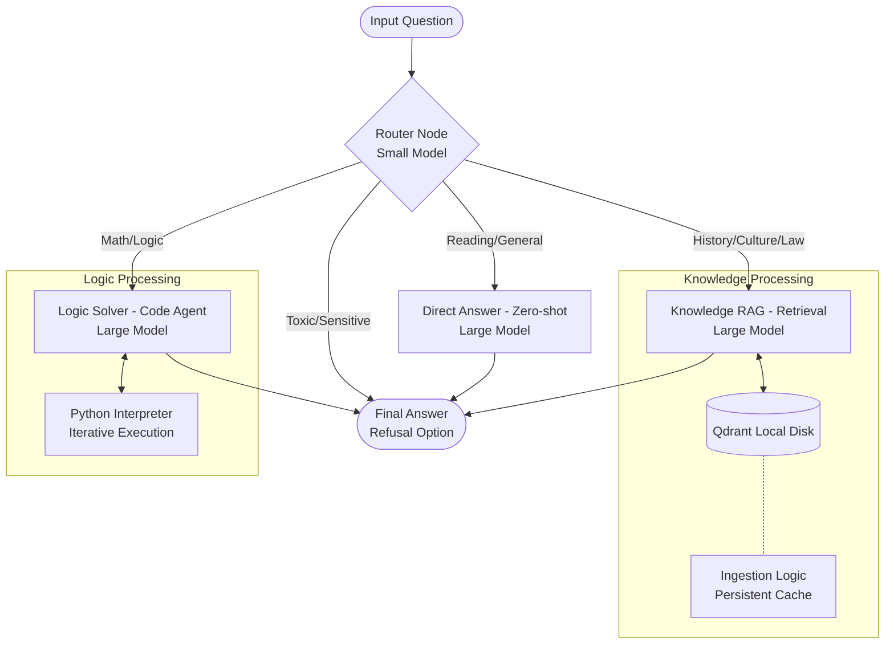

# VNPT AI RAG Pipeline

Agentic RAG Pipeline designed for the VNPT AI Hackathon (Track 2).

This project implements a modular, model-agnostic workflow using **LangGraph** to intelligently route questions, execute Python code for complex reasoning, and retrieve knowledge from a persistent vector store.

## 🚀 Key Features

- **Agentic Workflow**: Utilizes a **Router Node** to classify questions into distinct domains (Math, Knowledge, Direct Comprehension, or Toxic) and routes them to specialized solvers. Toxic content is handled immediately in the router by finding refusal options.
- **Program-Aided Language Models (PAL)**:
  - Solves math and logic problems by generating and executing Python code via a local REPL.
  - **Self-Correction Loop**: Iteratively executes code, captures output, and corrects errors (up to 5 retry steps).
- **Multi-Source Ingestion & Crawling**:
  - Integrated **Firecrawl** to crawl websites (single page, full domain, or topic search).
  - Supports ingestion of **JSON, PDF, DOCX, and TXT** files into the Vector DB.
  - **Text Normalization**: Automatic Unicode normalization and whitespace cleaning before ingestion.
- **Hybrid Model Selection**:
  - Supports both **Local HuggingFace** models and **VNPT API** models.
  - Per-model credentials for Large, Small, and Embedding models.
- **Quota Optimization**:
  - **Tiered Modeling Architecture**: Lightweight "Small" models for routing, "Large" models for deep reasoning/RAG.
  - **Smart Caching**: Local disk caching for **Qdrant** to prevent redundant re-embedding.
- **Responsible AI**: Safety guardrails in the router node to detect and refuse toxic, dangerous, or politically sensitive content by automatically selecting refusal options.

## 🏗️ Architecture

The pipeline is orchestrated by a **LangGraph StateGraph**:



### Components

1.  **Router Node**: A classifier using a small LLM to categorize inputs into: Math, RAG (Lookup), Direct (Reading Comprehension), or Toxic. When toxic content is detected, it automatically finds and returns the refusal option from choices (or defaults to "A" if none found), bypassing other nodes.
2.  **Logic Solver**: A Code Agent that extracts Python code from LLM responses, executes it locally, and parses the standard output. Includes error handling and retry logic.
3.  **Knowledge RAG**: Retrieves relevant context from the Qdrant vector store and generates answers using the large LLM.
4.  **Direct Answer**: Handles reading comprehension questions (based on provided text in the prompt) or general questions where retrieval is unnecessary.

## 🛠️ Tech Stack

| Component | Implementation |
| :--- | :--- |
| **Orchestration** | LangGraph, LangChain |
| **Package Manager** | uv |
| **Vector DB** | Qdrant (Local Persistence) |
| **Embedding** | BKAI Vietnamese Bi-encoder / VNPT API |
| **Web Crawler** | Firecrawl API |
| **Doc Parser** | pypdf, python-docx |
| **Code Execution** | LangChain Experimental PythonREPL |
| **Models** | Local HuggingFace or VNPT API (configurable via `.env`) |

## ⚡ Quick Start

### Prerequisites

  - Python ≥3.10
  - [uv](https://github.com/astral-sh/uv) (Recommended for fast dependency management)
  - CUDA-capable GPU (Recommended for local inference)

### Installation

1.  **Clone the repository**

    ```bash
    git clone https://github.com/duongtruongbinh/vnpt-ai
    cd vnpt-ai
    ```

2.  **Install dependencies**

    ```bash
    uv sync
    ```

3.  **Configure Environment**
    Create a `.env` file:

    ```env
    # Model Selection: True for VNPT API, False for local HuggingFace
    USE_VNPT_API=False

    # Local HuggingFace models (when USE_VNPT_API=False)
    LLM_MODEL_SMALL=/path/to/your/small/model
    LLM_MODEL_LARGE=/path/to/your/large/model
    EMBEDDING_MODEL=bkai-foundation-models/vietnamese-bi-encoder

    # VNPT API credentials (when USE_VNPT_API=True)
    VNPT_LARGE_AUTHORIZATION=Bearer your_token_here
    VNPT_LARGE_TOKEN_ID=your_token_id
    VNPT_LARGE_TOKEN_KEY=your_token_key
    VNPT_SMALL_AUTHORIZATION=Bearer your_token_here
    VNPT_SMALL_TOKEN_ID=your_token_id
    VNPT_SMALL_TOKEN_KEY=your_token_key
    VNPT_EMBEDDING_AUTHORIZATION=Bearer your_token_here
    VNPT_EMBEDDING_TOKEN_ID=your_token_id
    VNPT_EMBEDDING_TOKEN_KEY=your_token_key

    # Optional: Firecrawl for web crawling
    FIRECRAWL_API_KEY=your_key_here
    ```

### Usage

**1. Collect & Ingest Data (Optional)**
Expand your knowledge base by crawling websites or adding local documents.

  * **Crawl Data**: Fetch content from websites using the crawler CLI.

    ```bash
    # Crawl a website filtering by topic keywords
    uv run python scripts/crawl.py --url https://example.com --mode links --topic "keyword1,keyword2"
    ```

  * **Ingest Data**: Load crawled JSON files or local documents into the Qdrant vector store.

    ```bash
    # Ingest crawled data (use --append to keep existing data)
    uv run python scripts/ingest.py data/crawled/*.json --append

    # Ingest a folder of documents
    uv run python scripts/ingest.py --dir data/documents --append
    ```

**2. Run the Pipeline**
The system automatically handles vector ingestion on the first run.

```bash
uv run python main.py
```

  * **Input Priority:** The system looks for JSON files in `data/` in this order: `val.json`, `test.json`, `private_test.json`, `public_test.json`.
  * **Input Format:** JSON array with structure: `[{"qid": "...", "question": "...", "choices": ["A", "B", "C", "D"], "answer": "A"}, ...]`
  * **Output:** Results are saved to `output/submission.csv`.

## 📂 Project Structure

```
vnpt-ai/
├── data/                 
│   ├── qdrant_storage/   # Persistent Vector DB (Git ignored)
│   ├── crawled/          # Crawled website data (JSON)
│   ├── val.json          # Validation questions
│   └── test.json         # Test questions (JSON format)
├── scripts/
│   ├── crawl.py          # Web crawler CLI script (Firecrawl)
│   └── ingest.py         # Data ingestion CLI script (PDF/DOCX/JSON)
├── src/
│   ├── config.py         # Configuration & Environment loading
│   ├── graph.py          # LangGraph workflow definition
│   ├── state.py          # GraphState schema & utility functions
│   ├── nodes/
│   │   ├── router.py     # Classification & Toxic Handling Logic
│   │   ├── rag.py        # Retrieval Logic
│   │   ├── logic.py      # Python Code Agent Logic
│   │   └── direct.py     # Direct Reading Comprehension Logic
│   └── utils/
│       ├── llm.py        # Hybrid Model Loading (Local/API)
│       ├── ingestion.py  # Qdrant Ingestion, Text Normalization & Caching
│       ├── logging.py    # Color-coded logging utilities
│       ├── text_utils.py # Text processing utilities (answer extraction)
│       └── web_crawler.py # Web crawler utilities
├── main.py               # Application Entry Point (Async)
└── pyproject.toml        # Dependencies & Project Metadata
```

##  Input/Output Format

### Input (JSON)

```json
[
  {
    "qid": "Q001",
    "question": "Câu hỏi ở đây?",
    "choices": ["Đáp án A", "Đáp án B", "Đáp án C", "Đáp án D"],
    "answer": "A"  // Optional, for validation
  }
]
```

### Output (CSV)

```csv
qid,answer
Q001,A
Q002,B
```
