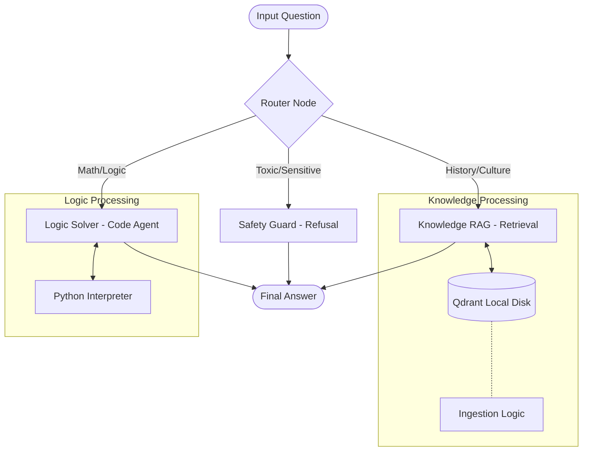

# VNPT AI RAG Pipeline

**High-performance Agentic RAG Pipeline** designed for the VNPT AI Hackathon (Track 2). 

This project implements a modular, model-agnostic workflow using **LangGraph** to intelligently route questions, execute Python code for math reasoning, and retrieve knowledge from a persistent vector store, optimizing for both accuracy and API quota efficiency.

## 🚀 Key Features

- **Agentic Workflow**: Uses a **Router Node** to classify questions (Math, Knowledge, or Toxic) and direct them to specialized solvers.
- **Quota Optimization**: 
  - **Tiered Modeling**: Uses "Small" models for routing (high volume) and "Large" models for reasoning/RAG (complex tasks).
  - **Persistent Embedding**: Implements local disk caching for Qdrant to prevent re-embedding and save quota.
- **Program-Aided Language Models (PAL)**: Solves math and logic problems by generating and executing Python code via a local REPL, eliminating LLM calculation errors.
- **Responsible AI**: Built-in safety guards to detect and refuse toxic or sensitive content.

## 🏗️ Architecture

The pipeline is orchestrated by a **LangGraph StateGraph**:



### Components

1.  **Router Node**: Uses a lightweight model to classify inputs.
2.  **Logic Solver**: A Code Agent that writes and executes Python to solve math problems.
3.  **Knowledge RAG**: A Retrieval-Augmented Generation node using Hybrid Search (Simulated) and persistent storage.
4.  **Safety Guard**: A deterministic filter for harmful content.

## 🛠️ Tech Stack

| Component | Development (Current) | Production (VNPT Integration) |
| :--- | :--- | :--- |
| **Orchestration** | LangGraph, LangChain | LangGraph, LangChain |
| **Router LLM** | Gemini Flash (Simulated) | **VNPT Small Model** |
| **Reasoning LLM** | Gemini Pro (Simulated) | **VNPT Large Model** |
| **Vector DB** | Qdrant (Local Persistence) | Qdrant (Local/Server) |
| **Embedding** | BKAI Vietnamese Bi-encoder | **VNPT Embedding** |

## ⚡ Quick Start

### Prerequisites

  - Python ≥3.10
  - [uv](https://github.com/astral-sh/uv) (recommended for fast setup)
  - Google API Key (for development simulation)

### Installation

```bash
# 1. Clone the repository
git clone https://github.com/duongtruongbinh/vnpt-ai
cd vnpt-ai

# 2. Install dependencies
uv sync

# 3. Configure Environment
# Copy .env.example to .env and add your keys
cp .env.example .env
```

### Usage

**1. Generate Dummy Data (Optional)**
Creates sample questions and a knowledge base for testing.

```bash
uv run python data/generate_dummy_data.py
```

**2. Run the Pipeline**
The system automatically handles vector ingestion.

  - *First run:* Embeds data and saves to `data/qdrant_storage` (Consumes Quota).
  - *Subsequent runs:* Loads from disk (Zero Quota usage).


```bash
uv run python main.py
```

  - **Input:** `data/public_test.csv` (or `private_test.csv`)
  - **Output:** `data/pred.csv`

## 📂 Project Structure

```
vnpt-ai/
├── data/                 
│   ├── qdrant_storage/   # Persistent Vector DB (Do not commit)
│   ├── knowledge_base.txt
│   └── public_test.csv
├── src/
│   ├── graph.py          # LangGraph workflow definition
│   ├── config.py         # Settings & Model configuration
│   ├── nodes/
│   │   ├── router.py     # Classification (Small Model)
│   │   ├── rag.py        # RAG Logic (Large Model)
│   │   └── logic.py      # Code Interpreter (Large Model)
│   └── utils/
│       └── ingestion.py  # Smart ingestion with caching
├── main.py               # Entry point
└── pyproject.toml        # Dependencies
```
